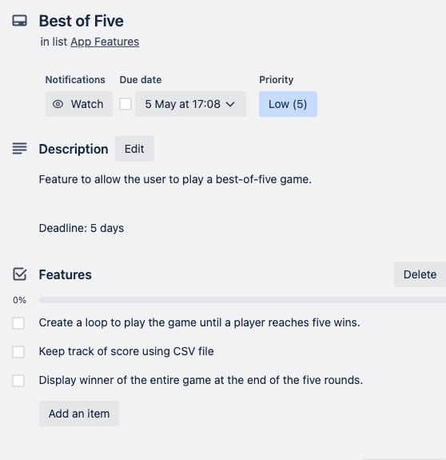

# <h1 style="text-align: center;">Rock Paper Scissors</h1>

[GitHub Repo](https://github.com/Looch8/rps-terminal-app.git)

<!-- To fill this out -->

[Link to YouTube Presentation]

## R5

This application will Adhere to the PEP8 python style guide (1).

## R6 - Features that will be included

This application is a Rock-Paper-Scissors game that allows a user to play against the computer and will be run entirely from the console.
The app has the following features:

1. A function that takes user input to get the player's choice of either rock, paper, or scissors. If the player types a keyword such as 'end', the program will terminate. If the player types an invalid input, the function will raise a ValueError and will re-prompt the player to choose again.

2. A function that will randomly generate the computer's choice of either rock, paper scissors.
   This is achieved by importing the python 'Random' module and using it to randomly pick an element from a list.

3. A function that takes 2 parameters and determines the winner of a single round of the game based on the player and computer's choice.
   If both choose the same option, the function will return 'draw'. If the player wins, the function returns 'player', and if the computer wins, the function returns 'computer'.
   With each round, there will be a score counter variable that will increase by 1 for whoever wins the round.

4. A function to save the scores to a CSV file.

5. A function that reads the scores from the CSV file and prints them to the console.

6. A main game function that runs the Rock-Paper-Scissors game. It will call the other functions to get the user and computer's choice, play a round, save the scores, and print the scores.
   While the score is less than 5, the round function will continue to loop, and receive input from the user, once the player or computer reaches 5 points, the game will end and the winner will be declared and printed to the console. If the player types 'end' or interrupts the game with a keyboard interrupt, the game will also end.

This app will include error handling and testing of the main functions.

## R7 Develop an implementation plan

I developed an implementation plan for my project using Trello.

These are all the features I would implement.
Each feature has a deadline, a checklist, and a description.

User input: High priority, deadline of 2 days

Computer's Turn: High priority, deadline of 2 days

Determine Winner: High priority, deadline of 2 days

Display Results: Medium priority, deadline of 3 days

Keep Score: Medium priority, deadline of 3 days

Display Scores: Medium priority, deadline of 3 days

Best of five: Low priority, deadline of 5 days

Add colour to output: Low priority, deadline of 5 days

 
\pagebreak 

## References

(1) [https://peps.python.org/pep-0008/](https://peps.python.org/pep-0008/)
